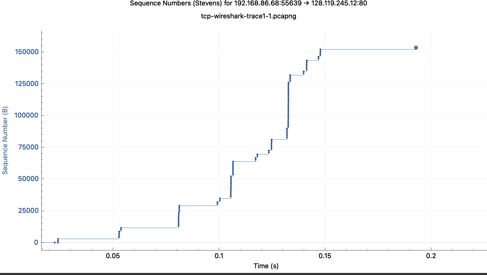

# Wireshark lab 1

1) What is the IP address and TCP port number used by the client computer (source) that is transferring the alice.txt file to gaia.cs.umass.edu? To answer this question, it’s probably easiest to select an HTTP message and explore the details of the TCP packet used to carry this HTTP message, using the “details of the selected packet header window” (refer to Figure 2 in the “Getting Started with Wireshark” Lab if you’re uncertain about the Wireshark windows)
   1) client ip: 192.168.86.68
   2) Port: 55639
2) What is the IP address of gaia.cs.umass.edu? On what port number is it sending and receiving TCP segments for this connection?
   1) gaia ip: 128.119.245.12
   2) port: 80
3) What is the sequence number of the TCP SYN segment that is used to initiate the TCP connection between the client computer and gaia.cs.umass.edu? What is it in this TCP segment that identifies the segment as a SYN segment?  Will the TCP receiver in this session be able to use Selective Acknowledgments (allowing TCP to function a bit more like a “selective repeat” receiver, see section 3.4.5 in the text)? (If you do not want to spend time reading about “selective repeat”, you can simply view it as being able to acknowledge individual packets, instead of acknowledging a batch of packets together).
   1) seq number is 0
   2) the flag is set as 0x002 - meaning the syn bit is flipped
   3) SACK is enabled for both client and server
4) What is the sequence number of the SYNACK segment sent by gaia.cs.umass.edu to the client computer in reply to the SYN? What is it in the segment that identifies the segment as a SYNACK segment? What is the value of the Acknowledgement field in the SYNACK segment? How did gaia.cs.umass.edu determine that value?
   1) seq number is 0
   2) the identifying value is the flag being set to 0x012 meaning both the ack and syn bit are 1
   3) it determined the value of 1 as it is true(?)
5) What is the sequence number of the TCP segment containing the header of the HTTP POST command? How many bytes of data are contained in the payload (data) field of this TCP segment? Did all of the data in the transferred file alice.txt fit into this single segment?
   1) seq number is 1
   2) 1448 Bytes
   3) This did not transmit all data
6) Consider the TCP segment containing the HTTP “POST” as the first segment in the data transfer part of the TCP connection.
   1) At what time was the first segment (the one containing the HTTP POST) in the data-transfer part of the TCP connection sent?
      1) Arrival Time: Feb  2, 2021 21:43:26.716922000 EST
   2) At what time was the ACK for this first data-containing segment received?
      1) Arrival Time: Feb  2, 2021 21:43:26.745546000 EST
   3) What is the RTT for this first data-containing segment?
      1) ~0.03 sec
   4) What is the RTT value the second data-carrying TCP segment and its ACK?
      1) Arrival Time: Feb  2, 2021 21:43:26.716923000 EST
      2) Arrival Time: Feb  2, 2021 21:43:26.745551000 EST
      3) ~0.03 sec
   5) What is the EstimatedRTT value (see Section 3.5.3, in the text) after the ACK for the second data-carrying segment is received? Assume that in making this calculation after the received of the ACK for the second segment, that the initial value of EstimatedRTT is equal to the measured RTT for the first segment, and then is computed using the EstimatedRTT equation on page 242, and a value of a = 0.125. Note: Wireshark has a nice feature that allows you to plot the RTT for each of the TCP segments sent. Select a TCP segment in the “listing of captured packets” window that is being sent from the client to the gaia.cs.umass.edu server. Then select: Statistics->TCP Stream Graph->Round Trip Time Graph.
      1) 0.03
7) What is the length (header plus payload) of each of the first four data-carrying TCP segments?
    1) 1514 bytes
8) What is the minimum amount of available buffer space advertised to the client by gaia.cs.umass.edu among these first four data-carrying TCP segments7? Does the lack of receiver buffer space ever throttle the sender for these first four data-carrying segments?
   1) Calculated window size: 131712
9) Are there any retransmitted segments in the trace file? What did you check for (in the trace) in order to answer this question?
    1) No. To check this i looked to see if any seq numbers were retransmitted
10) How much data does the receiver typically acknowledge in an ACK among the first ten data-carrying segments sent from the client to gaia.cs.umass.edu? Can you identify cases where the receiver is ACKing every other received segment (see Table 3.2 in the text) among these first ten data-carrying segments?
    1) 1,448 bytes
    2) no
11) What is the throughput (bytes transferred per unit time) for the TCP connection? Explain how you calculated this value.
    1) 861k bytes/s
    2) this was calcualted by using wiresharks summary/properties tool

12) Use the Time-Sequence-Graph(Stevens) plotting tool to view the sequence number versus time plot of segments being sent from the client to the
gaia.cs.umass.edu server. Consider the “fleets” of packets sent around t = 0.025, t = 0.053, t = 0.082 and t = 0.1. Comment on whether this looks as if TCP is in its slow start phase, congestion avoidance phase or some other phase. Figure 6 shows a slightly different view of this data.
    1) t = 0.025 slow start phase 
    2) t = 0.053 slow start phase
    3) t = 0.082 congstion avoidance phase
    4) t = 0.1 congestion avoidance phase
13) These “fleets” of segments appear to have some periodicity. What can you say about the period?
    1)  the period between each burst of data gets shorter over time
