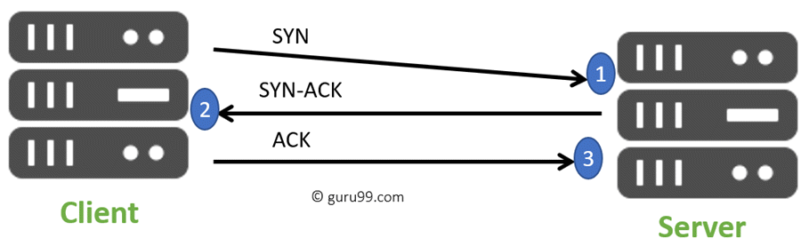

# Multiplexing

https://github.com/xvr6/cs3516/blob/main/notes/3/3.1%20-%20Transport%20Layer.md

## 3-way TCP handshake

- Syn
  - Used to initiate and establish a connection. It also helps you to synchronize sequence numbers between devices.
- ACK
  - Helps to confirm to the other side that it has received the SYN.
- SYN-ACK
  - SYN message from local device and ACK of the earlier packet.
- FIN
  - Used to terminate a connection.
